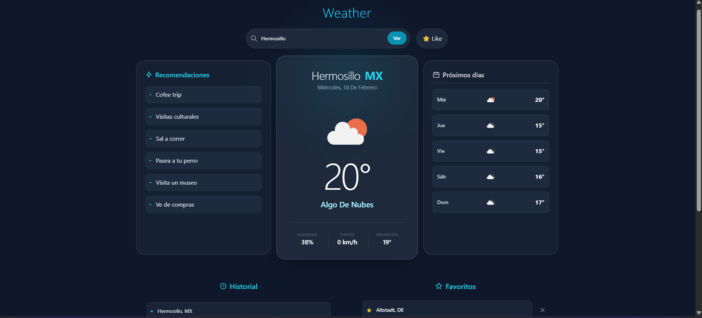
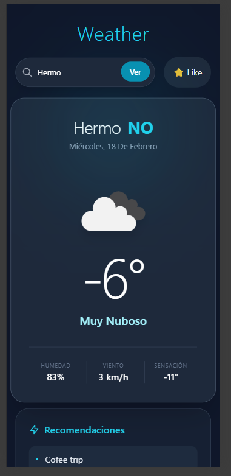

# 🌤️ Weather App 

Una aplicación de clima moderna y  diseñada para ofrecer una experiencia de usuario superior. No es solo un buscador de clima: es un dashboard inteligente que aprende de tus búsquedas, te sugiere actividades y maneja conexiones inestables con elegancia.

---

**[Ver Proyecto Desplegado](https://weather-app-eight-bice-93.vercel.app/)**

---

## Características 

*   **Autocompletado:** Sugerencias de ciudades mientras escribes con "debounce" para optimizar peticiones.
*   **Favoritos y Historial Persistente:** Guarda  ciudades y accede rápidamente a tus últimas búsquedas (almacenado en LocalStorage).
*   **Recomendaciones Personalizadas:** Sugiere actividades (correr, leer, café, etc.) basadas en el clima actual de la ciudad.
*   **Feedback Visual Completo:** Pantallas de carga (spinners)  y animaciones .

### Funcionalidad

*   **Manejo de errores:** 
    *   **Reintentos automáticos:** Si la red falla momentáneamente, la app reintenta conectar sola.
    *   **Circuit Breaker:** Si el servicio cae, bloquea temporalmente las peticiones para evitar saturación y avisa al usuario.

###  Datos Meteorológicos 
*   **Clima Actual:** Temperatura, sensación térmica, humedad, viento y condiciones visuales.
*   **Pronóstico a 5 Días:** Previsión detallada día a día.
*   **Diseño Responsive:** Grid adaptativo.

---

## Stack 

*   **Frontend:** HTML5, TailwindCSS, JavaScript .
*   **API Externa:** OpenWeatherMap (Geocoding, Weather, Forecast).
*   **Almacenamiento:** LocalStorage (Persistencia de datos en cliente).

## Vista previa

